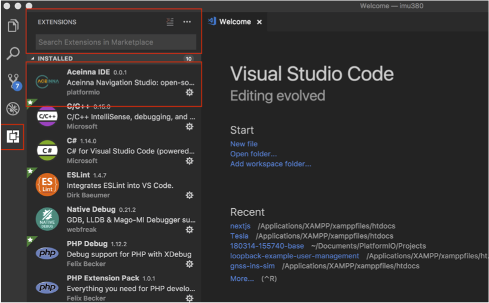
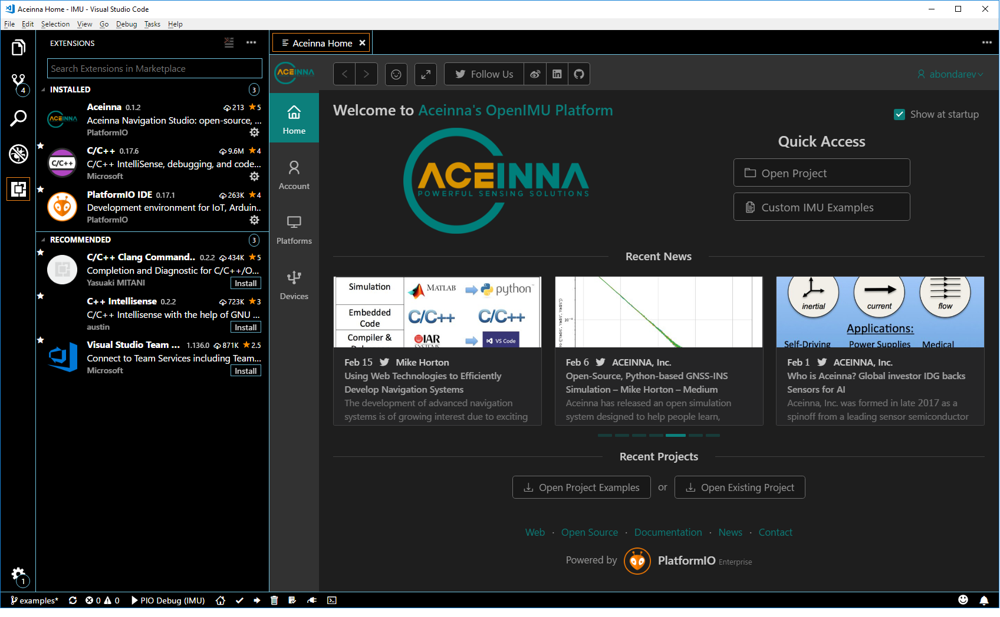

# **PC Tools Installation**  


------------------------------------------------------------  

#### **Platforms - Computers with the following Operating Systems**  

 - Windows 10 or 7
 - Ubuntu version 14.0 or later
 - MAC OS


#### **Visual Studio Code**

Visual Studio Code - can be downloaded from here:  https://code.visualstudio.com

#### **ST-LINK Debugger Driver**  

-   *MacOS* - ST-LINK drivers are automatically installed for MAC OS.
-   *Windows* - ST-LINK drivers should be also installed automatically. But in case if it was not - ST-LINK V2 driver can be manually installed for Windows.  The Windows driver is downloaded from the following page link:
    http://www.st.com/en/development-tools/st-link-v2.html
-   *Ubuntu* - please see step 5.

#### **Installation of OpenIMU development platform**

To install OpenIMU development platform:

1. Start Visual Studio Code.
2. On leftmost toolbar find "Extensions" icon and click on it.
3. In the text box "Search extensions on Marketplace" type "Aceinna" and hit enter
4. Install Aceinna Extension and Follow prompts.
       


#### **First steps**   
 
    &emsp After installation of "Aceinna" extension click on "Home" icon at the bottom of the screen. It will  
    &emsp bring up Aceinna OpenIMU platform homepage. Click on "Custom IMU examples", chose  
    &emsp desired example and click "Import".  


   

  The required example will be imported into working directory in folder:   
            
  C:\\Users\\<username>\\Documents\\platformio\\Projects\\ProjectName   
<center>  
    Now you can edit, build and test the project. All your changes will remain in the above-mentioned
    directory and subdirectories.  
    Next time when you return to development - open Aceinna "Home" page and click "Open Project", choose
    "Projects" and select  
    required project from the list.  

    The source tree of imported project tree has the following structure:  
</center>


```
        project directory -|
                           |
                           |                                   
                           |--- .pio --|
                           |           |-- build --|   
                           |           |           |-- board-|   
                           |           |                     |-- binary image (firmware.bin)  
                           |           |                     |-- elf image (firmware.elf)  
                           |           |                     .  
                           |           |                     .  
                           |           |                     .  
                           |           |
                           |           |- libdeps -|   
                           |           |           |-- board-|  Library dependencies
                           |                                 |      
                           |                                 |--library1 src tree
                           |                                 |   
                           |                                 |--library2 src tree
                           |                                 |   
                           |                                 |--library3 src tree
                           |                                 |   
                           |                                 .  
                           |                                 .  
                           |                                            
                           |                                            
                           |--include (optional user include files)              
                           |                                            
                           |--lib (optional user library directory tree)
                           |
                           |--src (user source files tree)
                           |
```

    
    
####    **Compile and JTAG Code Loading**   
<center>  
    Once you have imported an example project, a good first step is to compile and download this  
    application using your ST-LINK.At the bottom of the VS Code window is the shortcut toolbar  
    shown below.  To load an application to the OpenIMU with JTAG,simply click  
    the Install/Download button while the ST-LINK is connected to your EVB.  
</center>  
  
<center>  
    The OpenIMU development environment uses PlatformIO's powerful open-source builder and  
    IDE.This on-line  manual focuses on on OpenIMU specific information, and it does not attempt  
    to fully discuss all of the IDE's powerful  features in depth. For more information on PlatformIO  
    builder and IDE features include command line  interface, scripting and more please see the   
</center>   

[PlatformIO](https://docs.platformio.org)  

#### **5.  ST-LINK Install for Ubuntu (Manual Version)**  
  
    Go to https://github.com/texane/stlink and read instructions carefully.    
  
    On local Ubuntu machine, you will clone the aforementioned repository and make the project.  
    This requires the following packages to be installed:   
   
* CMake > v2.8.7  
* Gcc compiler  
* Libusb v1.0  

        ```  
        # Run from source directory stlink/  
        $make release  
        $cd build/Release  
        $sudo make install  
        # Plug ST-LINK/V2 into USB, and check the device is present  
        $ls /dev/stlink-v2  
        ```
